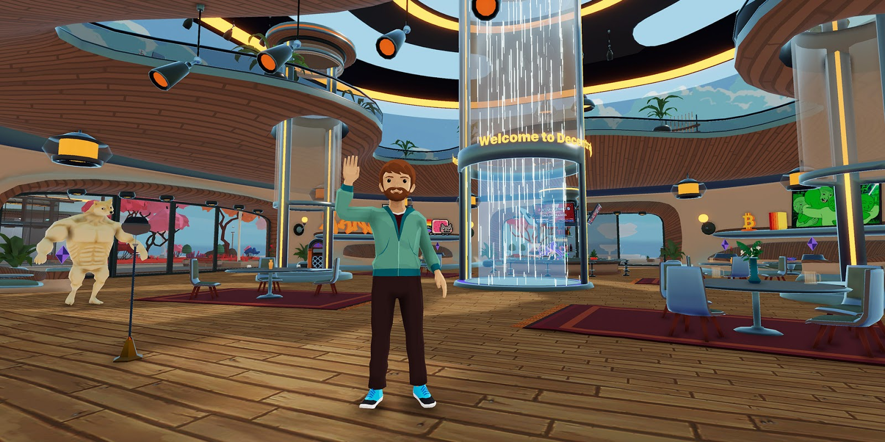
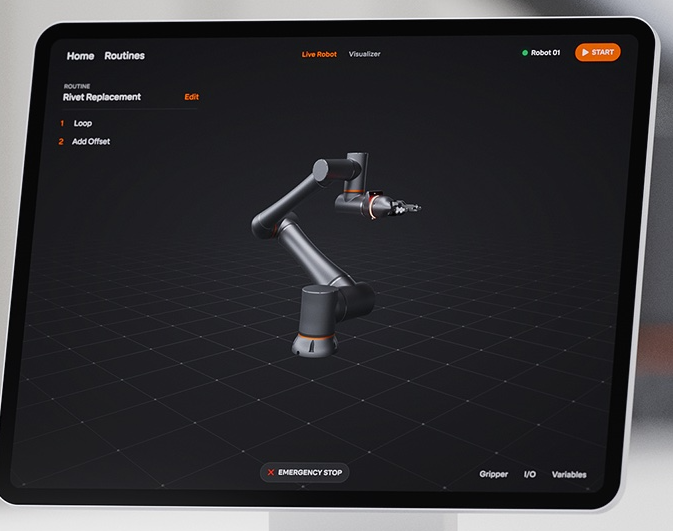

# threejs-dev-day

Use cases
- Gaming - Threejs powers decentraland

- Robotics - Standard robotics uses it for robotic system interfaces 
- Training - [up360](https://up360.co/gallery/) is using it to develop training VR training for welding, safety, and others.

Honestly it hasn't really caught on in industry as it came out in April 2010 and a quick search of indeed shows ~4 three.js jobs. 

But!! There's some really cool portfolio websites that are sure to impress
- https://bruno-simon.com/ 
- https://lusion.co/

Three.js is essentially a wrapper for WebGL, which is a lower level language for creating 3D & 2D renderings in a canvas element. If you're interested in learning more about the lower level, Fireship has a nice tl;dr video [WebGL 3D Graphics Explained in 100 Seconds](https://www.youtube.com/watch?v=f-9LEoYYvE4)

